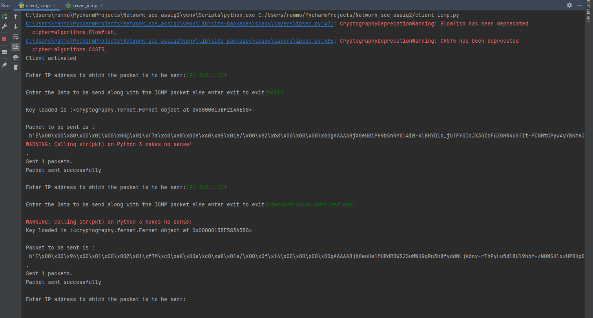
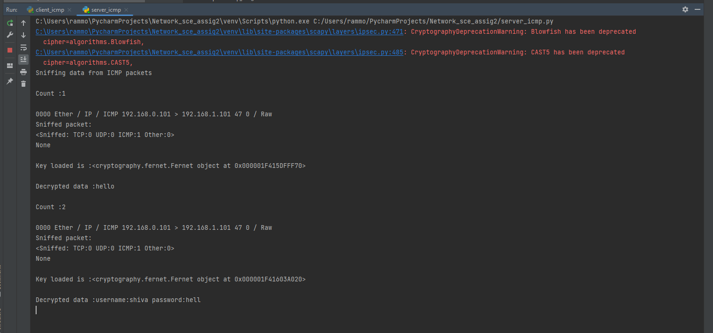

# Network Security - Assignment 2 #

## Introduction ##
   In Assignment 2 we have 3 tasks and I have chose task 1 Encrypted covert channel using ICMP protocol. The task main 
   objectives are to have a covert channel between a client and server whereas using the method of exfilteration of 
   sensitive data.So the assignment requires a covert channel communication between a client and a server. 
   whereas the client obtains the destination IP and the data from the user encrypts the data and crafts an ICMP packet 
   of type 47 (reserved) to a server. The server listens to the interface for this type of packet and obtains it and 
   decrypts to show the message.
   
## Approach ##
   The approach I have used to achieve this goal is to use a python script for both client and server using a Scapy 
   package. The reasoning is pretty simple scapy has a large extension of libraries to craft different packets and lot 
   more tools to obtain more packet manipulation etc.
   
### Client Side ###
   The client side from the requirements needs to obtain the Destination IP and the data from the user and craft a 
   ICMP packet of type 47 and attach the data encrypted to the destination IP. 
   * To craft a packet I have use ICMP layer package from scapy and used it like below.
       ``` packet_icmp = IP(dst=dst_ip) / ICMP(type=47) / encrypt_data ```
   * To encrypt I have a simple encryption key generator from Fernet from cryptography package and stored in key.key file
   * Finally, to send the packet I have used send method from scapy to send the packet to the server.

### Server Side ###
   The server side from the requirements is that the server listens to the ICMP packet and then decrypts the data
   * The Server listens for such packet using sniff method with which we can set the filter like I have used below.
     * sniff_packet = sniff(count=1, filter="dst 192.168.1.101", iface="Wi-Fi")
     * To decrypt I have used the same as the client, the key is obtained from key.key file and decrypt the data from reading the ICMP packet from the client. 

## How to Run: ##

   * To get your env preped to run the code pls run the below command
    ``` pip3 install -r requirements.txt ```
   * To run the script we have to first generate the key (if key.key file is not preset)
     ``` python encrpy_key_generate.py ```
   * To run the client and server it's the same as above
    ``` python client_icmp.py ``` ``` python server_icmp.py ```

## Logs ##
### Client Side ###

### Server Side ###
